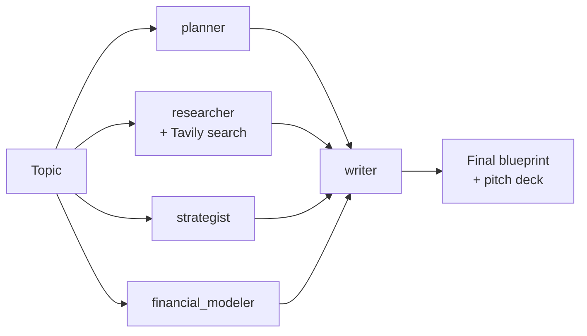

# Strategic Co-Founder Agent

A multi-agent system that takes a one-line startup idea and produces a
business blueprint: plan, competitor research (grounded in real web
search), strategy, financial model, and pitch deck outline.

This is a student project (third-year AI/ML, not a funded product), built
to demonstrate real agent-orchestration engineering — not a single prompt
dressed up as a "multi-agent system." See [Limitations](#limitations)
below for exactly what's real and what's mocked.

## What it does

Given a topic like `"AI-powered personal finance coaching for gig workers"`,
five agents run against it:

| Agent | Job | Grounded in |
|---|---|---|
| `planner` | Feature set, MVP scope, 8-week roadmap | LLM reasoning |
| `researcher` | Competitors, differentiation, market validation | **Real web search (Tavily)** |
| `strategist` | Revenue model, pricing, GTM, SWOT | LLM reasoning |
| `financial_modeler` | Cost structure, revenue projections, unit economics | LLM reasoning, assumptions stated explicitly |
| `writer` | Synthesizes all four into one blueprint + pitch deck | The other four agents' outputs |

See [`examples/sample_output.md`](examples/sample_output.md) for a full
worked example.

## Architecture

The pipeline is expressed as an explicit dependency graph, not a linear
script. `planner`, `researcher`, `strategist`, and `financial_modeler`
don't depend on each other — they only need the topic — so they run
**concurrently**. `writer` depends on all four, so it runs after, once
they've all finished.



`core/orchestrator.py` implements this generically: agents and their
dependencies are declared as `Node`s, the engine resolves them into
execution layers via a topological sort (Kahn's algorithm), and every
node within a layer runs concurrently with `asyncio.gather`. Adding a
sixth agent later is a one-node addition to the graph, not a rewrite of
control flow.

### Why no LangGraph / CrewAI

A framework would wrap the same 4-node graph in someone else's
abstractions without adding capability at this scale. Writing the DAG
resolution and async fan-out/fan-in directly is what demonstrates
understanding of agent orchestration, rather than the ability to call a
library that does it invisibly. If a specific job posting calls for
LangGraph or CrewAI by name, that's a legitimate reason to swap the
orchestration layer later — the agent and LLM-client boundaries here are
designed to make that a contained change.

### Error isolation

Each agent's `run()` catches its own failures and returns a failed
`AgentResult` instead of raising. One agent failing (e.g. a rate limit)
doesn't crash the pipeline — `writer` still runs on whatever succeeded,
and failures are reported in `run.json` for that run.

## Setup

```bash
git clone <your-repo-url>
cd AI_Agent
python -m venv venv
source venv/bin/activate   # Windows: venv\Scripts\activate
pip install -r requirements.txt
cp .env.example .env
```

Edit `.env` and add two keys, both free:

- `GEMINI_API_KEY` — [aistudio.google.com/apikey](https://aistudio.google.com/apikey), no credit card required
- `TAVILY_API_KEY` — [tavily.com](https://tavily.com), free tier

## Run

CLI (primary interface):

```bash
python main.py
# Enter business idea theme: AI-powered personal finance coaching for gig workers
```

Optional Gradio UI (same orchestrator, different front end):

```bash
python app.py
# open http://localhost:7860
```

Each run is saved to `output/<run_id>/` — one `.md` file per agent, plus
`run.json` with timing and success/failure per agent. `output/` is
gitignored; nothing from a real run gets committed.

## Tests

```bash
pytest
```

15 tests, all mocked (no network calls, no API keys needed to run them):
- `tests/test_agents.py` — prompt construction, failure isolation per agent, researcher's fallback when search fails
- `tests/test_orchestrator.py` — DAG layering, cycle detection, **concurrency verified by timing** (three 0.2s mock agents complete in well under 0.6s), fan-in context passing, failed nodes not propagating into downstream context

## Limitations

Honest accounting of what's real vs mocked, since this is a portfolio
piece and overclaiming defeats the purpose:

- **Real:** `researcher` performs live web search via Tavily and grounds
  its output in actual search snippets — not just LLM training data.
- **Real:** the parallel execution is genuine — verified by the timing
  test in `test_orchestrator.py`, not just claimed in the README.
- **Mocked/LLM-only:** `planner`, `strategist`, and `financial_modeler`
  reason from the model's training knowledge, not live data sources.
  Financial projections are directional order-of-magnitude estimates
  with stated assumptions — not audited numbers, and shouldn't be
  treated as investment-grade modeling.
- **No persistent memory across runs.** Each run is stateless; there's
  no learning from or recall of prior runs. (The old version of this
  project had a file literally named `memory.py` that didn't do this —
  it just logged outputs. This version calls that `run_store.py`.)
- **No authentication, no multi-user support, no database.** Outputs are
  files on disk. That's an intentional scope decision for a portfolio
  project, not an oversight — adding a persistence layer would be the
  natural next step if this became a real product.
- **Gemini free tier rate limits apply** (see [ai.google.dev/gemini-api/docs/rate-limits](https://ai.google.dev/gemini-api/docs/rate-limits)) —
  fine for demo use, not for production traffic.

## Project structure

```
AI_Agent/
├── main.py                    # CLI entrypoint
├── app.py                     # optional Gradio UI
├── config.py                  # env var loading and validation
├── core/
│   ├── llm_client.py          # Gemini wrapper, retry/backoff
│   ├── search_client.py       # Tavily wrapper
│   ├── orchestrator.py        # DAG engine
│   ├── models.py               # AgentResult, PipelineRun
│   └── run_store.py           # persists runs to output/<run_id>/
├── agents/
│   ├── base.py                # shared async execution, error isolation
│   ├── planner.py
│   ├── researcher.py
│   ├── strategist.py
│   ├── financial_modeler.py
│   └── writer.py
├── tests/
└── examples/
    └── sample_output.md
```
